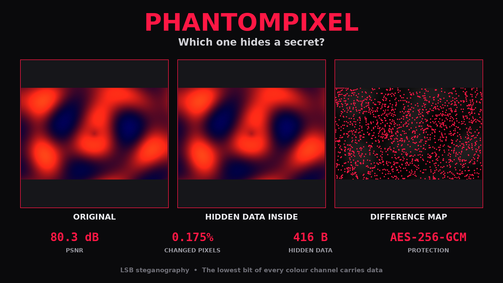

<div align="center">

# PHANTOMPIXEL

**Hide data inside images. Invisible to the eye.**
An LSB steganography studio: hide, extract, inspect, and generate shareable comparison cards.




*The two images on the left are indistinguishable. The map on the right shows how the hidden data is scattered across the picture.*

</div>

---

## Features

- **Hide text or any file** (PDF, ZIP, photo...) inside an image. Capacity depends on the image size.
- **One-question flow:** type a message, or just press Enter to pick a file with a normal file dialog.
- **Back at every step:** type `<` at any prompt to go back; on the first step it returns to the menu.
- **Drag & drop smart mode:** drop an image onto the program. It extracts if the image holds hidden data, otherwise it starts hiding.
- **Password protection:** AES-256-GCM with a key derived by `scrypt`. The pixels that carry the data are chosen by a password-keyed permutation.
- **Reliable by design:** integrity check (CRC-32), automatic read-back verification after every write, refuses to overwrite your original image, atomic file writes.
- **Inspector:** exact signature check, a statistical chi-square detector, PSNR, and an LSB-plane view.
- **Share card:** a 1920x1080 image showing *original | hidden | difference map*.
- **Quick demo:** one key shows the whole pipeline. No files needed.
- **Runs without Python:** build a single-file `.exe` (or download it from Releases).

## Quick start

### A) Windows EXE (no Python needed)

1. Download `PhantomPixel.exe` from the [Releases](../../releases) page, **or** double-click `build_exe.bat` to build it yourself (`dist\PhantomPixel.exe`).
2. Copy it to a USB stick and double-click it on any Windows PC.
3. Press `1` then Enter for the demo, or drag an image onto the `.exe`.

> The EXE is unsigned, so Windows SmartScreen or an antivirus may warn you. Choose "Run anyway".
> This happens with every unsigned PyInstaller program.

### B) From source

```bash
pip install -r requirements.txt
python main.py
```

On Windows you can simply double-click `run.bat`.

## Using the menu

| Key | Action   | What it does                                                    |
|-----|----------|-----------------------------------------------------------------|
| 1   | Demo     | Hides, extracts and shows the comparison card with one key      |
| 2   | Hide     | Cover image → secret (text or file) → password (optional) → go  |
| 3   | Extract  | Image → password (if needed) → message or file                  |
| 4   | Inspect  | Signature check, statistical test, comparison with the original |
| 5   | Card     | Builds the shareable comparison image                           |
| 6   | Capacity | How much data fits into an image                                |

At every prompt: **drop a file** onto the window, **paste a path**, or **press Enter** to open the file dialog.
Type **`<`** to go back one step.

Results are saved **next to the image you chose** (`photo.png` → `photo_phantom.png`), and the program can open the folder for you.

## Command line

```bash
python main.py                                  # interactive menu
python main.py photo.png                        # smart mode (same as drag & drop)
python main.py demo
python main.py hide cover.png -m "secret text" --card
python main.py hide cover.png -f report.pdf -p  # -p asks for a password (hidden input)
python main.py extract cover_phantom.png -p
python main.py inspect cover_phantom.png --original cover.png
python main.py card cover.png cover_phantom.png
```

## How it works

Every pixel has three colour channels (R, G, B), each a number from 0 to 255. Changing the
**least significant bit** (LSB) of a channel moves its value by at most 1, which is invisible:

```
channel value:     1 1 0 0 1 0 0 [1]   = 201
                                ^ lowest bit = 1 bit of hidden data
hidden bit is 0:   1 1 0 0 1 0 0 [0]   = 200   (difference: 1/255)
```

With a password two more things happen:

1. The data is encrypted with **AES-256-GCM**.
2. The pixels that hold the bits are chosen by a **keyed permutation**, so the data is spread over the whole
   image instead of sitting in one block. Without a password the permutation is keyed by the public salt,
   which still avoids a visible stripe at the top of the image.

### File format (v2)

A 29-byte header is written sequentially into the first bits, the body is scattered over the rest:

| Field  | Size  | Meaning                                              |
|--------|-------|------------------------------------------------------|
| MAGIC  | 4 B   | `PPX2`                                               |
| FLAGS  | 1 B   | bit 0: password-protected                            |
| SALT   | 16 B  | random per file (scrypt salt / scatter seed)         |
| LENGTH | 4 B   | body length                                          |
| CRC32  | 4 B   | integrity check of the body                          |
| BODY   | ...   | `[nonce 12B] + data + [tag 16B]` or plain data       |

The permutation is a Feistel network with cycle walking: O(n) memory (a 48 MP photo is no problem) and pure
integer maths, so it is identical on every platform. A golden-value test guards the format against accidental changes.

## Project structure

Every module has one job; `main.py` is the single entry point that wires them together.

```
main.py                  entry point (menu, smart mode, command line)
phantompixel/
├── config.py            constants, format definition, theme
├── errors.py            exception hierarchy
├── crypto.py            scrypt + AES-256-GCM
├── engine.py            LSB embedding / extraction, keyed permutation, verification
├── analyzer.py          PSNR, difference stats, chi-square detector
├── visuals.py           difference map, LSB plane, share card
├── workflows.py         glue used by both the UI and the command line
├── demo.py              file-less one-key demo
├── picker.py            native file dialog (tkinter)
├── ui.py                rich terminal UI with step-by-step wizards
└── utils.py             small helpers
tests/                   unit tests
build_exe.bat            one-click .exe build (Windows)
run.bat                  one-click run from source (Windows)
.github/workflows/       automatic .exe build on GitHub
```

Run the tests:

```bash
python -m unittest discover -s tests -v
```

## Automatic EXE builds (GitHub Actions)

Push a tag such as `v2.0.0` and GitHub builds `PhantomPixel.exe` on Windows, runs the tests and attaches it to the **Releases** page:

```bash
git tag v2.0.0
git push origin v2.0.0
```

You can also start it manually: **Actions → Build Windows EXE → Run workflow**.

## Limitations and honest notes

- **JPEG destroys the data.** A stego image must stay a **PNG**. Instagram, WhatsApp (photo mode), X/Twitter and most
  messengers recompress images. Send the stego image as a *file/document*. For social media, post the card made by the `card` command.
  If an image was damaged this way, PhantomPixel tells you instead of returning garbage.
- **The detector is a heuristic.** The chi-square test is strong on heavily filled, unscattered images and weak on lightly
  filled or scattered ones. A low score never proves an image is clean. The *signature check* is exact, but only recognises PhantomPixel images.
- **Not secure against professional steganalysis.** LSB replacement is classic and educational; advanced attacks (e.g. RS analysis)
  can detect it. The header magic bytes also make PhantomPixel images recognisable by design.
- **The password is the secret, not the image.** There is no password recovery.
- Educational project. Use it responsibly.

## Contributing

Issues and pull requests are welcome. Ideas: LSB matching (±1) to resist the chi-square test, more languages,
a graphical interface, 2-bit-per-channel mode, audio steganography.

## License

MIT, see [LICENSE](LICENSE).
